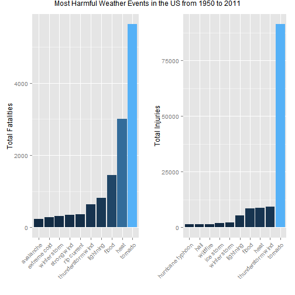
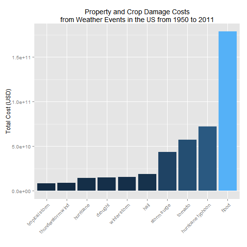
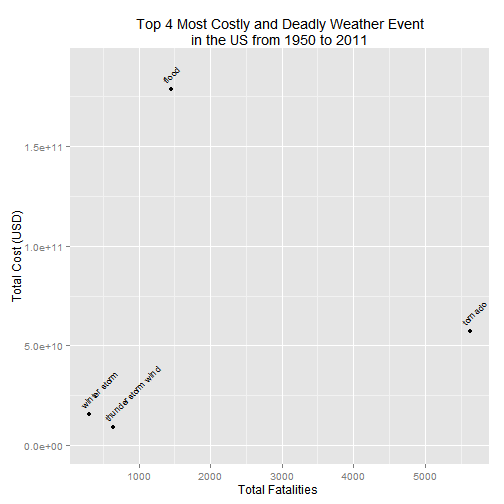

###Synopsis

This data analysis project explored the U.S. National Oceanic and Atmospheric Administration's (NOAA) storm database. It addressed which types of weather events are most harmful with respect to population health, and which cost the most economically, across the US from 1950-2011.

The data analysis outlines that the majority weather events result in relatively **low economic costs and low fatality rates**. However, two events stand out as outliers: **Tornados and Floods**. 

**Tornados** are responsible for **the majority of fatalities with moderate economic costs**.  
**Floods** are responsible for **the majority of the economic costs with moderate fatalities**.

A government or municipal manager responsible for preparing for severe weather events with limited budget, will have to prioritize between these two major costs.

###Introduction

Storms and other severe weather events can cause both public health and economic problems for communities and municipalities. Many severe events can result in fatalities, injuries, and property damage, and preventing such outcomes to the extent possible is a key concern.

This project involves exploring the U.S. National Oceanic and Atmospheric Administration's (NOAA) storm database. This database tracks characteristics of major storms and weather events in the United States, including when and where they occur, as well as estimates of any fatalities, injuries, and property damage.

### Raw Data

The data for this assignment come in the form of a comma-separated-value file compressed via the bzip2 algorithm to reduce its size. You can download the file from the course web site:

- [Storm Data][1] [47Mb]

There is also some documentation of the database available. Here you will find how some of the variables are constructed/defined.

- National Weather Service [Storm Data Documentation][2]

- National Climatic Data Center Storm Events [FAQ][3]

The events in the database start in the year 1950 and end in November 2011. In the earlier years of the database there are generally fewer events recorded, most likely due to a lack of good records. More recent years should be considered more complete

[1]: https://d396qusza40orc.cloudfront.net/repdata%2Fdata%2FStormData.csv.bz2
[2]: https://d396qusza40orc.cloudfront.net/repdata%2Fpeer2_doc%2Fpd01016005curr.pdf
[3]: https://d396qusza40orc.cloudfront.net/repdata%2Fpeer2_doc%2FNCDC%20Storm%20Events-FAQ%20Page.pdf

### Loading and Processing the Raw Data

Load the NOAA Storm Dataset in a data table and check its dimension.


```r
library(data.table)
```

```
## data.table 1.9.4  For help type: ?data.table
## *** NB: by=.EACHI is now explicit. See README to restore previous behaviour.
## 
## Attaching package: 'data.table'
## 
## The following object is masked _by_ '.GlobalEnv':
## 
##     .N
```


```r
storm <- read.csv("repdata-data-StormData.csv")
storm <- data.table(storm)

dim(storm)
```

```
## [1] 902297     37
```

Output the summary and structure of the data set to get a sense of the variables and their type.


```r
summary(storm)
str(storm)
```

We are interested in the different types of weather events (EVTYPE). Let's have a look at how many unique event names we are dealing with.


```r
length(unique(storm$EVTYPE))
```

```
## [1] 985
```

Let's make the names all lowercase and replace any punctuation by a blank space.


```r
events <- tolower(storm$EVTYPE)
events <- gsub("[[:blank:][:punct:]+]", " ", events)
length(unique(events))
```

```
## [1] 874
```

By doing so, we cleaned up some of duplicate event names and replace them in the dataset.


```r
storm$EVTYPE <- events
```

#### Impact on Population Health 

The impact of weather events on US population health can be measured with the variables *FATALITIES* and *INJURIES*.

Firstly, we sum all the fatalities an injuries across 1950-2011 for each events and construct a new data frame.


```r
library(plyr)
```

```r
health <- ddply(storm, .(EVTYPE), summarize, Fatalities = sum(FATALITIES), Injuries = sum(INJURIES))
```

#### Top 10 Fatality Events

Let's have a look at the top 20 weather events with the most fatalities.


```r
top.fatalities <- data.table(head(health[order(health$Fatalities, decreasing = T), 1:2], 20))
top.fatalities
```

```
##                      EVTYPE Fatalities
##  1:                 tornado       5633
##  2:          excessive heat       1903
##  3:             flash flood        978
##  4:                    heat        937
##  5:               lightning        816
##  6:               tstm wind        504
##  7:                   flood        470
##  8:             rip current        368
##  9:               high wind        248
## 10:               avalanche        224
## 11:            winter storm        206
## 12:            rip currents        204
## 13:               heat wave        172
## 14:            extreme cold        162
## 15:       thunderstorm wind        133
## 16:              heavy snow        127
## 17: extreme cold wind chill        125
## 18:               high surf        104
## 19:             strong wind        103
## 20:                blizzard        101
```

It can be noted that some of the event names are redundant, such as *heat, excessive heat and heat wave*. These number of fatalities can be added together and combined into a single variable *heat*. This process is repeadted for other duplicate variables: *flood, thunderstorm, strong wind, winter storm, extreme cold* 


```r
heat <- c(which(top.fatalities$EVTYPE == "heat"),
          which(top.fatalities$EVTYPE == "excessive heat"),
          which(top.fatalities$EVTYPE == "heat wave"))

top.fatalities$Fatalities[heat[1]] <- sum(top.fatalities$Fatalities[heat])
top.fatalities <- top.fatalities[-heat[2:3],]

flood <- c(which(top.fatalities$EVTYPE == "flood"),
           which(top.fatalities$EVTYPE == "flash flood"))

top.fatalities$Fatalities[flood[1]] <- sum(top.fatalities$Fatalities[flood])
top.fatalities <- top.fatalities[-flood[2],]

thunderstorm <- c(which(top.fatalities$EVTYPE == "thunderstorm wind"),
                  which(top.fatalities$EVTYPE == "tstm wind"))

top.fatalities$Fatalities[thunderstorm[1]] <- sum(top.fatalities$Fatalities[thunderstorm])
top.fatalities <- top.fatalities[-thunderstorm[2],]

wind <- c(which(top.fatalities$EVTYPE == "strong wind"),
          which(top.fatalities$EVTYPE == "high wind"))

top.fatalities$Fatalities[wind[1]] <- sum(top.fatalities$Fatalities[wind])
top.fatalities <- top.fatalities[-wind[2],]

winter.storm <- c(which(top.fatalities$EVTYPE == "winter storm"),
                  which(top.fatalities$EVTYPE == "blizzard"))

top.fatalities$Fatalities[winter.storm[1]] <- sum(top.fatalities$Fatalities[winter.storm])
top.fatalities <- top.fatalities[-winter.storm[2],]

cold <- c(which(top.fatalities$EVTYPE == "extreme cold"),
          which(top.fatalities$EVTYPE == "extreme cold wind chill"))

top.fatalities$Fatalities[cold[1]] <- sum(top.fatalities$Fatalities[cold])
top.fatalities <- top.fatalities[-cold[2],]
```

The weather events are now re-ranked and only the **Top 10 Fatality Events** are kept.


```r
top.fatalities <- head(top.fatalities[order(top.fatalities$Fatalities, decreasing = T),],10)
top.fatalities
```

```
##                EVTYPE Fatalities
##  1:           tornado       5633
##  2:              heat       3012
##  3:             flood       1448
##  4:         lightning        816
##  5: thunderstorm wind        637
##  6:       rip current        368
##  7:       strong wind        351
##  8:      winter storm        307
##  9:      extreme cold        287
## 10:         avalanche        224
```

####Top 10 Injury Events

Now let's have a look at the top 20 weather events with the most injuries.


```r
top.injuries <- data.table(head(health[order(health$Injuries, decreasing = T), c(1,3)], 20))
top.injuries
```

```
##                 EVTYPE Injuries
##  1:            tornado    91346
##  2:          tstm wind     6957
##  3:              flood     6789
##  4:     excessive heat     6525
##  5:          lightning     5230
##  6:               heat     2100
##  7:          ice storm     1975
##  8:        flash flood     1777
##  9:  thunderstorm wind     1488
## 10:               hail     1361
## 11:       winter storm     1321
## 12:  hurricane typhoon     1275
## 13:          high wind     1137
## 14:         heavy snow     1021
## 15:           wildfire      911
## 16: thunderstorm winds      908
## 17:           blizzard      805
## 18:                fog      734
## 19:   wild forest fire      545
## 20:         dust storm      440
```

Similar as in fatalities event names, it can be noted that some are redundant. These number of injuries can be added together and combined into single variables: *heat, flood, thunderstorm, winter storm, wildfire*. 


```r
heat <- c(which(top.injuries$EVTYPE == "heat"),
          which(top.injuries$EVTYPE == "excessive heat"))

top.injuries$Injuries[heat[1]] <- sum(top.injuries$Injuries[heat])
top.injuries <- top.injuries[-heat[2],]

flood <- c(which(top.injuries$EVTYPE == "flood"),
           which(top.injuries$EVTYPE == "flash flood"))

top.injuries$Injuries[flood[1]] <- sum(top.injuries$Injuries[flood])
top.injuries <- top.injuries[-flood[2],]

thunderstorm <- c(which(top.injuries$EVTYPE == "thunderstorm wind"),
                  which(top.injuries$EVTYPE == "thunderstorm winds"),
                  which(top.injuries$EVTYPE == "tstm wind"))

top.injuries$Injuries[thunderstorm[1]] <- sum(top.injuries$Injuries[thunderstorm])
top.injuries <- top.injuries[-thunderstorm[2:3],]

winter.storm <- c(which(top.injuries$EVTYPE == "winter storm"),
                  which(top.injuries$EVTYPE == "blizzard"))

top.injuries$Injuries[winter.storm[1]] <- sum(top.injuries$Injuries[winter.storm])
top.injuries <- top.injuries[-winter.storm[2],]


wildfire <- c(which(top.injuries$EVTYPE == "wildfire"),
              which(top.injuries$EVTYPE == "wild forest fire"))

top.injuries$Injuries[wildfire[1]] <- sum(top.injuries$Injuries[wildfire])
top.injuries <- top.injuries[-wildfire[2],]
```

The weather events are now re-ranked and only the **Top 10 Injury Events** are kept.


```r
top.injuries <- head(top.injuries[order(top.injuries$Injuries, decreasing = T),],10)
top.injuries
```

```
##                EVTYPE Injuries
##  1:           tornado    91346
##  2: thunderstorm wind     9353
##  3:              heat     8625
##  4:             flood     8566
##  5:         lightning     5230
##  6:      winter storm     2126
##  7:         ice storm     1975
##  8:          wildfire     1456
##  9:              hail     1361
## 10: hurricane typhoon     1275
```

#### Impact on Economic Cost

The impact of weather events on US ecomonic cost can be measured with the variables *PROPDMG* (property damage) and *CROPDMG* (crop damage). In addition, the variables *PROPDMGEXP* and *CROPDMGEXP* indicate the order of magnitude of each observation: *'h' = hundred, 'k' = thousand, 'm' = million, 'b' = billion.*

The exponent variables are turned into lower case characters. 


```r
storm$PROPDMGEXP <- tolower(storm$PROPDMGEXP)
storm$CROPDMGEXP <- tolower(storm$CROPDMGEXP)
```

The following function converts the exponential characters into numeric multipliers.


```r
multiplier <- function(x){
    if (x == 'h')
        return(100)
    else if (x == 'k')
        return(10**3)
    else if (x == 'm')
        return(10**6)
    else if (x == 'b')
        return(10**9)
    else if (!is.na(as.numeric(x)))
        return(10**as.numeric(x))
    else if (x %in% c('', '-', '?', '+'))
        return(1)
    else {
        stop("Invalid order of magnitude.")
    }
}
```

We use the multiplier function to convert all the property and crop damage cost to the same unit (USD).


```r
propMulti <- sapply(storm$PROPDMGEXP, FUN = multiplier) 
cropMulti <- sapply(storm$CROPDMGEXP, FUN = multiplier) 
```

The property costs and crop costs are added together to form a new variable in the dataset, *TotalCost*.


```r
storm$PropCost <- storm$PROPDMG * propMulti
storm$CropCost <- storm$CROPDMG * cropMulti
storm$TotalCost <- storm$PropCost + storm$CropCost
```

We sum the total costs across 1950-2011 for each events and construct a new data frame.


```r
cost <- ddply(storm, .(EVTYPE), summarize,
              TotalCost = sum(TotalCost))
```

#### Top 10 Most Costly Events

Let's have a look at the top 20 most costly weather event.


```r
top.costs <- data.table(head(cost[order(cost$TotalCost, decreasing = T), ], 20))
```

It can be noted again that some event names are redundant. These number of damage costs can be added together and combined into single variables: *flood, thunderstorm*. 


```r
flood <- c(which(top.costs$EVTYPE == "flood"),
           which(top.costs$EVTYPE == "flash flood"),
           which(top.costs$EVTYPE == "river flood"))

top.costs$TotalCost[flood[1]] <- sum(top.costs$TotalCost[flood])
top.costs <- top.costs[-flood[2:3],]

storm <- c(which(top.costs$EVTYPE == "winter storm"),
           which(top.costs$EVTYPE == "ice storm"))

top.costs$TotalCost[storm[1]] <- sum(top.costs$TotalCost[storm])
top.costs <- top.costs[-storm[2],]

thunderstorm <- c(which(top.costs$EVTYPE == "thunderstorm wind"),
                  which(top.costs$EVTYPE == "tstm wind"))

top.costs$TotalCost[thunderstorm[1]] <- sum(top.costs$TotalCost[thunderstorm])
top.costs <- top.costs[-thunderstorm[2],]
```

The weather events are now re-ranked and only the **Top 10 Most Costly Events** are kept.


```r
top.costs <- head(top.costs[order(top.costs$TotalCost, decreasing = T),],10)
```

###Results


```r
library(ggplot2)
library(gridExtra)
```

#### Graph 1: Most Harmful Weather Events in the US from 1950 to 2011 


```r
graph1 <- ggplot(data = top.fatalities, aes(x = reorder(EVTYPE, Fatalities), y = Fatalities, fill = Fatalities)) +
          geom_bar(stat="identity") +
          ylab("Total Fatalities") +
          xlab("") +
          theme(axis.text.x = element_text(angle = 45, hjust = 1), legend.position="none")

graph2 <- ggplot(data = top.injuries, aes(x = reorder(EVTYPE, Injuries), y = Injuries, fill = Injuries)) +
          geom_bar(stat="identity") +
          ylab("Total Injuries") +
          xlab("") +
          theme(axis.text.x = element_text(angle = 45, hjust = 1), legend.position="none")

grid.arrange(graph1, graph2, ncol = 2, main = "Most Harmful Weather Events in the US from 1950 to 2011")
```

 

####Graph 2: Property and Crop Damage Costs from Weather Events in the US from 1950 to 2011


```r
graph3 <- ggplot(data = top.costs, aes(x = reorder(EVTYPE, TotalCost), y = TotalCost, fill = TotalCost)) +
    geom_bar(stat="identity") +
    ylab("Total Cost (USD)") +
    xlab("") +
    ggtitle("Property and Crop Damage Costs\nfrom Weather Events in the US from 1950 to 2011") +
    theme(axis.text.x = element_text(angle = 45, hjust = 1), legend.position="none")
graph3
```

 

####Graph 3: Top 4 Most Costly and Deadly Weather Event in the US from 1950 to 2011

Both tables are combined together into a new data table with respect to common even types. The new table contains the **Top 4 Most Costly and Deadly Weather Event.**


```r
fatalities.costs <- merge(top.fatalities, top.costs, by = "EVTYPE")
```


```r
graph4 <- ggplot(data = fatalities.costs, aes(x = Fatalities, y = TotalCost, label = EVTYPE)) +
          geom_point() +
          ylab("Total Cost (USD)") +
          ylim(0, 1.9*(10**11)) +
          xlab("Total Fatalities ") +
          ggtitle("Top 4 Most Costly and Deadly Weather Event\nin the US from 1950 to 2011") +
          geom_text(angle=45, vjust=-1, hjust=0, size=3)
graph4
```

 

It is interesting to note that most weather events (such as winter storm, thunderstorm wind) result in relatively **low economic costs and low fatality rates**. However tornado and flood events are **outliers**. Moreover, tornados are responsible for **the majority of deaths with moderate economic costs**. On the other hand, floods are responsible for **the majority of the economic costs with moderate deaths**.

###Conlusion

There has been large number of weather events that have affected the US population's health and the economy over the years from 1950-2011. Two events stand out in particular: **Tornados and Floods**. However these two events have quite different external outcomes. **Tornados** are the most costly in terms of **human lifes**, whereas **floods** are the most costly in terms of **economic damage**. A government or municipal manager responsible for preparing for severe weather events with limited budget, will have to prioritize between these two major costs. 


.


